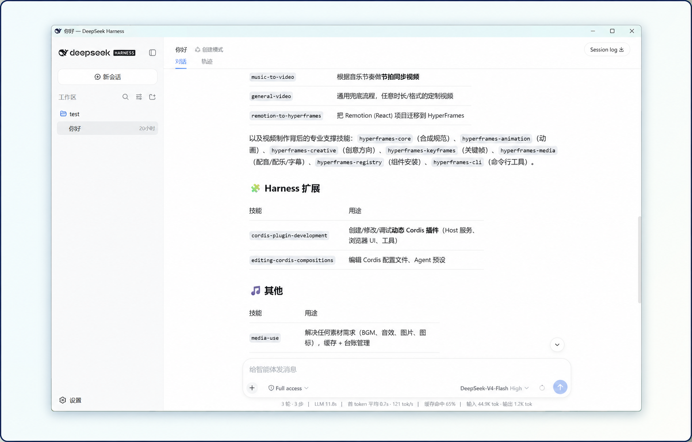
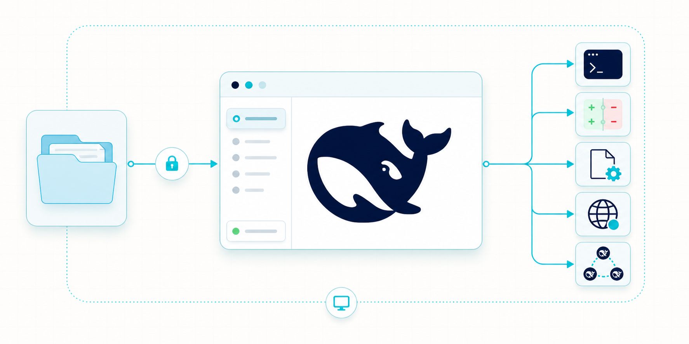

# DeepSeek Harness Desktop

[English](README.md) | 中文


DeepSeek Harness Desktop 是一个独立开源的 Windows 桌面发行项目，基于 [DeepSeek Harness](https://github.com/deepseek-ai/deepseek-harness) 构建。它将完整的 Harness Web 界面、本地智能体运行时、原生目录选择器和受控后端封装到一个 Electron 应用中。

这是社区维护的独立发行版，并非 DeepSeek 官方桌面客户端。上游 Harness 的架构与 package 源码仍归属 DeepSeek AI，并按 [MIT 许可证](LICENSE)保留署名。

## 下载

从[最新桌面版 Release](https://github.com/GoAlvin/deepseek-harness-desktop/releases/tag/desktop-v0.1.0-rc.10)下载 Windows x64 安装包：

- `DeepSeek-Harness-0.1.0-rc.10-x64.exe`
- SHA-256：`DDD1A872452F8C6798D123BABFD79CFA4DC60D465DD47CBC022304B14BFBDF8D`

安装包尚未进行代码签名，Windows SmartScreen 可能显示“未知发布者”警告。运行安装包前请核对 SHA-256 摘要。

## 运行效果

下图展示了打包后的 Windows 应用运行真实 Harness 会话的界面。



## 功能

- 在原生桌面窗口中提供完整的 DeepSeek Harness Web UI。
- 提供无传统标题栏的 Windows 窗口、可靠拖动区域、原生窗口按钮和 Aqua 玻璃主题。
- 由单一桌面应用负责后端启动、就绪检测、关闭与崩溃清理。
- 使用 Windows 原生文件夹选择器，不向 renderer 暴露 Node 或 Electron API。
- 集成 Cost Meter，统计会话、今日、本月和累计费用，并提供预算、余额、历史记录与 Token 用量。
- 支持通过局域网或可选的 Cloudflare 临时公网隧道，从手机浏览器安全访问。
- 提供手机访问总开关、公网隧道开关、二维码配对和可见的 cloudflared 下载进度。
- 核心 Harness 服务在随机本地端口上仅监听 loopback。
- 自定义应用、安装器、开始菜单与桌面快捷方式图标。
- 打包 Koffi、Sharp、ripgrep 和 `node-pty` 原生运行时。
- 支持用户级 Harness profile、设置、凭据与会话持久化。

桌面宿主将所选工作区、本地后端和智能体能力统一置于仅限 loopback 的应用边界内。



## 开源组件与插件

| 组件 | 用途 | 源码 | 许可证与分发方式 |
| --- | --- | --- | --- |
| DeepSeek Harness | 智能体运行时、Web UI、CLI 与插件基础 | [deepseek-ai/deepseek-harness](https://github.com/deepseek-ai/deepseek-harness) | MIT；本仓库保留上游源码及其署名。 |
| Aqua `dsh-client-ui-aqua@1.3.1` | 透明玻璃外观与主题设置 | [DSH-Transparent-UI-Plugin](https://github.com/WYH66666666/DSH-Transparent-UI-Plugin) | MIT；固定使用上游 npm package，不复制或修改其源码。 |
| Cost Meter `dsh-cost-meter@1.5.19` | 费用、用量、预算、余额、历史记录与 Token 统计 | [dsh-cost-meter](https://github.com/Han-1413141/dsh-cost-meter) | MIT；固定使用上游 npm package，不复制或修改其源码。 |
| Mobile Web `@deepseek-ai/dsh-client-mobile-web` | 需要认证的局域网与公网手机浏览器访问 | [mobile-web 源码](packages/client/mobile-web/README.md) | MIT；完整源码由本仓库维护。 |
| cloudflared `2026.8.2` | 可选的 Cloudflare 临时 Quick Tunnel | [cloudflare/cloudflared](https://github.com/cloudflare/cloudflared) | Apache-2.0；仅在开启公网访问后下载官方二进制，并校验其 SHA-256 摘要。 |

第三方项目保留其原作者署名与许可证。手机访问流程参考了 [dsh-pocket](https://github.com/shaobeichen/dsh-pocket)，但本仓库没有包含或复制 dsh-pocket 源码。生成的依赖清单与许可证文本见 [THIRD_PARTY_NOTICES.md](THIRD_PARTY_NOTICES.md)。

<a id="run"></a>

## 首次使用

1. 安装并打开 DeepSeek Harness Desktop。
2. 选择一个工作区文件夹。
3. 打开**设置 → 模型**，输入 DeepSeek API 密钥并保存。
4. 在所选工作区中开始对话。

提供方凭据保存在应用的用户级 Harness 数据目录下。renderer 只能收到脱敏后的凭据描述；支持的提供方和存储行为见[提供方指南](docs/user/guide/providers.md)。

## 从源码运行

环境要求：

- Windows 10 或 Windows 11，x64
- Node.js `^22.19` 或 `>=24`
- pnpm `11.7.0`

```powershell
git clone https://github.com/GoAlvin/deepseek-harness-desktop.git
cd deepseek-harness-desktop
corepack enable
pnpm install
pnpm run desktop
```

`pnpm run desktop` 会构建仓库并启动桌面应用。仅使用浏览器开发时，可以运行 `pnpm dsh web`。

## 打包桌面应用

```powershell
pnpm run desktop:pack
pnpm run desktop:dist
```

`desktop:pack` 生成解包后的 Windows 应用，`desktop:dist` 在 `dist-desktop-installer/` 下生成交互式 NSIS 安装包。打包细节与 smoke 测试入口见[桌面 package 参考](apps/desktop/README.md)。

## 项目结构

- [`apps/desktop/`](apps/desktop/)：Electron 主进程、打包配置、图标和安装版运行时 smoke 测试。
- [`apps/cli/`](apps/cli/)：`dsh` profile 启动器，以及桌面宿主使用的父进程关闭路径。
- [`packages/client/mobile-web/`](packages/client/mobile-web/)：需要认证的手机浏览器代理、配对界面与 Quick Tunnel 生命周期。
- [`packages/`](packages/)：Harness 插件，包括桌面父进程目录选择器传输层。
- [`docs/`](docs/)：用户、架构、开发与扩展文档。
- [`vendor/`](vendor/)：从上游 Harness 继承的固定版本 Cordis 源码。

## 安全模型

renderer 禁用 Node 集成，启用上下文隔离和 Chromium sandbox，并拒绝权限请求。导航仅允许启动页文档和确切的本地 Harness origin；外部 HTTP 与 HTTPS 链接会在操作系统浏览器中打开。

核心 Harness 服务仅监听 `127.0.0.1`。这可以防止直接的远程网络访问，但不会认证以同一 Windows 用户身份运行的其他进程。

手机访问使用独立的认证代理，并且默认关闭。开启总开关后会建立局域网监听；继续开启公网访问后，才会启动 Cloudflare 临时 Quick Tunnel。二维码和配对链接包含随机访问凭据：请只分享给预期用户，不要转发，并在使用完毕后关闭手机访问。Harness 凭据始终留在桌面端，不会发送给手机浏览器。

## 当前限制

- 目前仅提供 Windows x64 打包目标。
- 安装包没有发布者证书和自动更新器。
- Cloudflare Quick Tunnel 链接是临时链接，不保证可用性；重新开启公网访问后，旧链接立即失效。
- Harness profile Junction 无法指向 ASAR 虚拟文件系统中的 package，因此真实目录插件布局会产生体积较大且内容可检查的安装目录。
- 项目沿用上游开发者预览兼容性策略，不同版本之间可能包含破坏性变更。

## 文档与贡献

建议从[用户指南](docs/user/guide/index.md)、[桌面 package 参考](apps/desktop/README.md)、[开发指南](docs/development.md)和[架构文档](docs/architecture.md)开始。贡献代码时请遵循 [CONTRIBUTING.md](CONTRIBUTING.md) 与 [AGENTS.md](AGENTS.md)。

## 许可证与上游

本项目按 [MIT 许可证](LICENSE)分发，第三方依赖及其许可证列于 [THIRD_PARTY_NOTICES.md](THIRD_PARTY_NOTICES.md)。

DeepSeek Harness Desktop 派生自 [deepseek-ai/deepseek-harness](https://github.com/deepseek-ai/deepseek-harness)。本仓库独立发布桌面集成源码与二进制安装包，并保留上游声明与源码署名。
